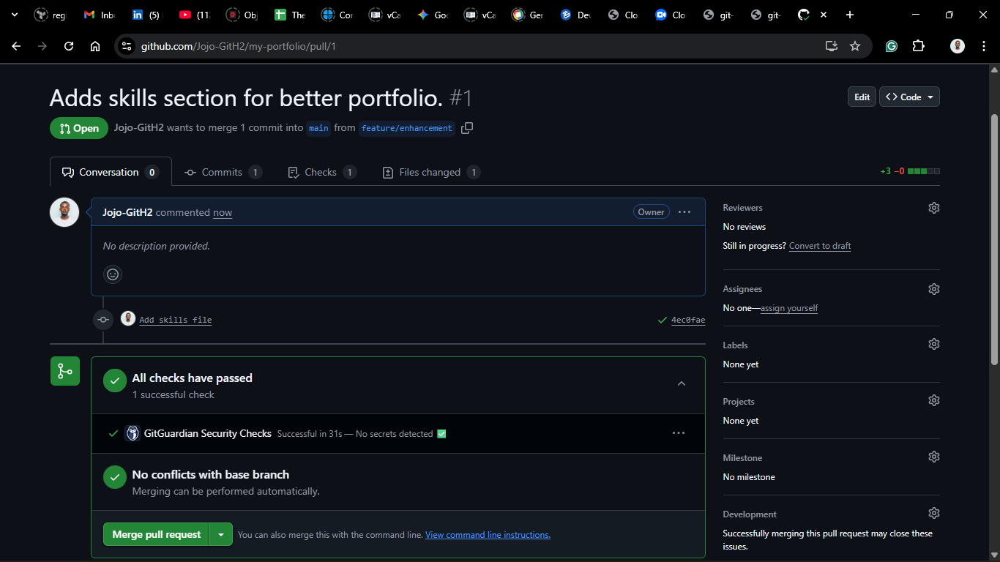
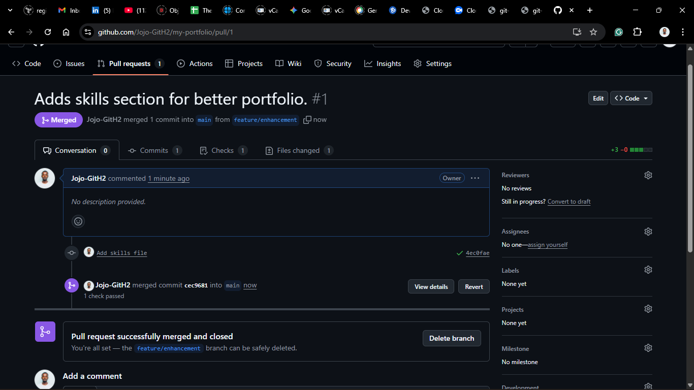

# Lab Report

## Screenshots

### 1. Original Commit history

### 2. Commit history after creating and making changes to a new branch

### 3. Conflict resolution and merging branches

### 4. Remote Collaboration with Github

## Reflections

### What was challenging?

I didn't face any challenge while completing this lab.

### How does Git help in DevOps Teams?

Git helps DevOps teams by enabling version control, facilitating collaboration, and streamlining the development process. It allows multiple team members to work on the same codebase simultaneously, track changes, and manage different versions of the code efficiently. This leads to improved productivity, better code quality, and faster delivery of software.
